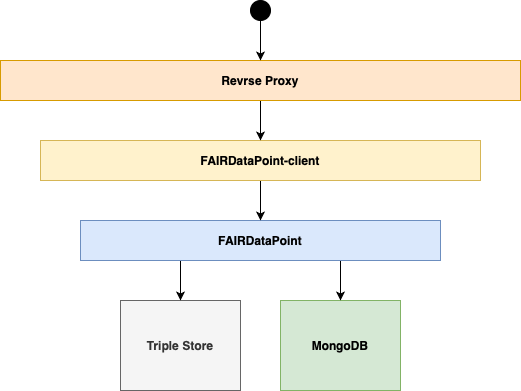

.. _components:

**********
Components
**********

The deployment of the FAIR Data Point consists of a couple of components. See the following image for the overview:

Triple Store
============

Every FAIR Data Point needs to store the semantic data somewhere. A triple Store is a place where the data is. It is possible to configure different stores, see :ref:`Triple Stores configuration <triple-stores>` for more details.

MongoDB
=======

Besides semantic data, FDP needs information about user accounts and their roles. These data are stored in `MongoDB <https://www.mongodb.com>`__ database.

FAIRDataPoint
=============

FAIRDataPoint is distributed in Docker image ``fairdata/fairdatapoint``. It is the core component which handles all the business logic and operations with the semantic data. It also provides API for working with data in different formats.

FAIRDataPoint-client
====================

FDP client is distributed in Docker image ``fairdata/fairdatapoint-client``. It provides the user interface for humans. It works as a reverse proxy in front of the FAIR Data Point which decides whether the request is for machine-readable data and passes it to the FAIRDataPoint or from a web browser in which case it serves the interface for humans.

Reverse Proxy
=============

In a production deployment, there is usually a reverse proxy that handles HTTPS certificates, so the connection to the FAIR Data Point is secured. See :ref:`production deployment <production-deployment>` to learn how to configure one.
