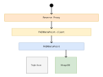

.. _components:

**********
Components
**********

A typical deployment of a FAIR Data Point consists of five components, as depicted in the following image:

FAIRDataPoint
=============

The FAIRDataPoint component (``fdp``) is the core back-end component that handles all the business logic and operations on semantic data.
All functionality of this server-side application is exposed through a REST API.
Documentation for this API is generated by the ``fdp`` itself, and is available at the path ``/swagger-ui/index.html``.

The ``fdp`` component can be deployed without a client (API only), but it is usually combined with the FAIRDataPoint-client_ component described below.
It is also possible to combine the ``fdp`` component with a custom client.

The FAIRDataPoint component is available as Docker image `fairdata/fairdatapoint`_.

FAIRDataPoint-client
====================

The FAIRDataPoint-client component (``fdp-client``) provides a user interface for humans, including a convenient admin interface.
The ``fdp-client`` is a client-side application that runs in a web browser and communicates with the ``fdp`` back-end using the API.

Note that the ``fdp-client`` component uses a built-in `nginx`_ instance for request routing based on content negotiation:

- Requests coming from a web browser (``Accept: text/html``) are assumed to be for human consumption, and are routed to the client-side application, which is served in the form of a *static* site.
- Requests with other content-types, such as ``text/turtle``, or those with an explicit format in the url query, such as `?format=ttl`, are assumed to be for machine-readable data, and are routed directly to the API.

The FAIRDataPoint-client component is available as Docker image `fairdata/fairdatapoint-client`_.

Third-party components
======================

The FAIR Data Point relies on several third-party components

MongoDB
-------

The FDP uses a `MongoDB <https://www.mongodb.com>`__ database to store application data, i.e. data required for the application to function properly, such as settings, user accounts, roles, metadata schemas, and so on.

Triple Store
------------

The FAIR Data Point needs a triple store to store its semantic data.
A variety of triple stores are supported, as described in :ref:`Triple Stores configuration <triple-stores>`.
If no external triple store is configured, the FDP will fall back on an in-memory triple store.

Reverse Proxy
-------------

In a production deployment, there is usually a reverse proxy that handles HTTPS certificates (SSL/TLS), so the connection to the FAIR Data Point is secured.
See :ref:`production deployment <production-deployment>` to learn how to configure one.

.. _fairdata/fairdatapoint: https://hub.docker.com/r/fairdata/fairdatapoint
.. _fairdata/fairdatapoint-client: https://hub.docker.com/r/fairdata/fairdatapoint-client
.. _nginx: https://nginx.org/index.html
