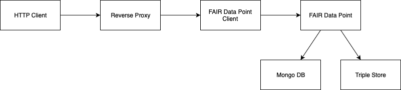

************
Installation
************

FAIR Data Point
===============

FAIR Data Point is distributed as a Docker image. For a basic setup, you
need to run just `Mongo DB database <https://docs.mongodb.com/>`__. You
can use Docker Compose to run FDP and Mongo DB together:

#. Create a folder (e.g., ``/fdp``) and enter it
#. Copy docker-compose.yml provided below
#. Run the FAIR Data Point with Docker compose ``docker-compose up -d``
#. After starting up, you will be able to open the FAIR Data Point in
   your browser on http://localhost
#. You can use ``docker-compose logs`` to see the logs and
   ``docker-compose down`` to stop all the services

.. code:: yaml

    version: '3'
    services:

      fdp:
        image: fairdata/fairdatapoint
        restart: always
        ports:
          - 80:80

      mongo:
          image: mongo:4.0.12
          restart: always
          ports:
            - 27017:27017
          command: mongod

Default users
-------------

Initially, migrations will fill the database with predefined data needed including users, all with password "password":

* albert.einstein@example.com (admin)
* nikola.tesla@example.com (user)

You can use those accounts for testing or to initially made your own account admin and then delete them.

.. DANGER::

   Having public instance with default accounts is a **security risk**. Delete or change default accounts (mainly Albert Einstein) if your FDP instance is public as soon as possible.

FDP Client
==========

You can run FAIR Data Point without the client if you need the API only.
If you want a user interface for browsing the metadata and
administration of the FAIR Data Point metadata and users, you can deploy
FAIR Data Point together with this client.

FDP Client works as a proxy before the FAIR Data Point itself. It
decides which request should pass through to the FDP (e.g., API calls)
and which should be handled by the client (requests from browsers).
Therefore, you no longer need to have FAIR Data Point exposed publicly.

FAIR Data Point Client is distributed as a Docker image. It runs
together with the FAIR Data Point.

**Configuration**

+----------------+-----------------------------------------------------------------------------------------------------------------------------------------------------------------------------------------+
| ENV Variable   | Description                                                                                                                                                                             |
+================+=========================================================================================================================================================================================+
| FDP\_HOST      | A hostname of the FAIR Data Point (within the Docker network).                                                                                                                          |
+----------------+-----------------------------------------------------------------------------------------------------------------------------------------------------------------------------------------+
| PUBLIC\_PATH   | Use only if FDP is not running at the root, you need to specify the URL. For example, if you run FDP at https://example.com/fairdatapoint, PUBLIC\_PATH should be ``/fairdatapoint``.   |
+----------------+-----------------------------------------------------------------------------------------------------------------------------------------------------------------------------------------+

**Example**

Here is an example `Docker Compose <https://docs.docker.com/compose/>`__
configuration to run FDP and FDP client together:

.. code:: yaml

    version: '3'
    services:
        server:
            image: fairdata/fairdatapoint
            # ... FDP configuration

        client:
            image: fairdata/fairdatapoint-client
            ports:
                - 80:80
            environment:
                - FDP_HOST=server  # using hostname within the Docker network

You can have a look at a complete example in `FAIR Data Point Example repository <https://github.com/FAIRDataTeam/FAIRDataPoint-Example>`__.

.. Tip::

    It is recommended to run FDP and FDP client behind a reverse proxy with SSL certificates. See further in the docs examples how to do that.

Here is a diagram with the overview of different componets of the FAIR Data Point.

Setting up a reverse proxy
==========================

If you want to run publicly available FDP, you should use HTTPS protocol
with valid certificates. It is easy to configure FDP to run behind a
reverse proxy which takes care of the certificates. Here are some
examples of how to configure nginx as a reverse proxy for FDP in
different cases.

When setting ``proxy_pass``, there is a ``<client_host>`` placeholder.
Use the name of the Docker container in your deployment instead. Also,
you need to set up Docker DNS resolver somewhere in the configuration.

::

    resolver 127.0.0.11 valid=10s;

Running FDP on domain root
--------------------------

This is an example of running FDP as the root application on domain
``fairdatapoint.example.com``.

.. code:: nginx

    server {
        listen 443 ssl;
        ssl_certificate /etc/letsencrypt/live/fairdatapoint.example.com/fullchain.pem;
        ssl_certificate_key /etc/letsencrypt/live/fairdatapoint.example.com/privkey.pem;

        server_name fairdatapoint.example.com;

        location / {
            proxy_pass http://<client_host>;
            proxy_set_header Host $host;
            proxy_pass_request_headers on;
        }
    }

    # Redirect to https
    server {
        listen 80;
        server_name fairdatapoint.example.com;
        return 301 https://$host$request_uri;
    }

